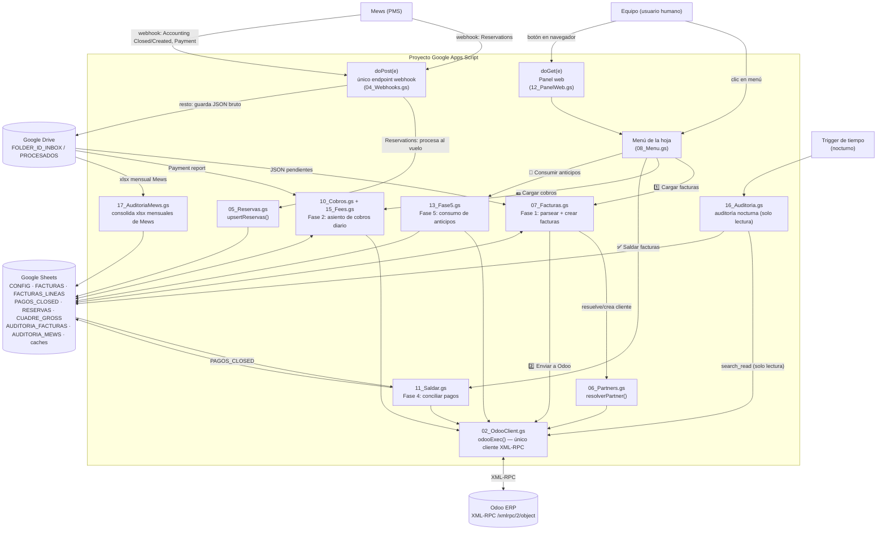

# Mews → Odoo

Integración contable entre **Mews** (PMS del hotel) y **Odoo** (ERP), implementada como
un proyecto de **Google Apps Script** ligado a una hoja de Google Sheets. Recibe los
informes que Mews envía por webhook (facturación, cobros, reservas), los deja en bruto
en Sheets/Drive para revisión, y bajo control manual del equipo (menú de la hoja o un
panel web propio) los transforma en facturas, asientos de cobro y conciliaciones dentro
de Odoo.

Proyecto reconstruido desde cero a partir de julio de 2026 (sustituye a una hoja/código
anterior). Se construye "de uno en uno": cada fase (Facturas, Cobros, Saldar, Anticipos,
Auditoría) se valida contra datos reales antes de pasar a la siguiente, y convive con el
sistema viejo hasta que el equipo confirma que puede apagarse.

## 1. Resumen

El sistema escucha 4 tipos de informe que Mews puede enviar por webhook (Accounting
Closed, Accounting Created, Payment Report, Reservations), los guarda para procesar bajo
demanda, y ofrece un flujo de botones (menú de Sheets o panel web) que: crea facturas en
Odoo a partir del cierre contable de Mews, crea asientos de cobro diarios, concilia esas
facturas contra los pagos reales, y audita cada noche que nada se haya perdido por el
camino — todo indexado en pestañas de la misma hoja de Google Sheets, sin base de datos
externa.

## 2. Quickstart

Para levantar el sistema desde cero, en este orden:

1. **Crea la hoja de Google Sheets** con las pestañas obligatorias (ver [§4](#4-estructura-de-archivos--pestañas-de-datos)).
   `RESERVAS`, `HUECOS_NUMERACION`, `PAGOS_CLOSED`, `CUADRE_GROSS` y `AUDITORIA_FACTURAS`
   las crea el propio script la primera vez que hacen falta — no hace falta crearlas a mano.
2. **Pega el código**: Extensiones → Apps Script → crea un archivo `.gs` por cada archivo
   de este repo (mismo nombre) y pega el contenido tal cual. Crea también un archivo HTML
   llamado exactamente `Panel` con el contenido de `Panel.html`.
3. **Configura** la pestaña `CONFIG` (clave | valor) con el mínimo indicado en [§5](#5-configuración)
   y guarda `ODOO_API_KEY` en Propiedades del script (nunca en la hoja).
4. **Verifica**: menú → "⚙️ Comprobar configuración" y "🔌 Probar conexión con Odoo".
5. **Despliega el Web App**: Implementar → Nueva implementación → Aplicación web (una
   sola vez — ver [§6](#6-cómo-desplegar-un-cambio)). Apunta esa URL en Mews para las 4
   suscripciones del webhook.
6. **Primera carga de datos**: sube a mano a la carpeta Drive `FOLDER_ID_INBOX` los JSON
   de Accounting Closed del periodo a reprocesar (o espera a que lleguen por webhook).
7. Desde el menú de la hoja, en orden: "🗺️ Cargar reservas de Mews" → "1️⃣ Cargar facturas
   nuevas de Mews" → revisa la pestaña `FACTURAS` → "2️⃣ Enviar facturas a Odoo".
8. Antes de dar por bueno el arranque: compara el total facturado del periodo en la hoja
   contra el resumen de Mews. Con eso cuadrado, ya se puede seguir con Cobros/Saldar.

## 3. Arquitectura

Todo el código vive en un único proyecto de Apps Script ligado a la hoja de cálculo.
Mews solo habla por HTTP con un único endpoint (`doPost`); todo lo demás lo dispara el
equipo a mano (menú o panel web), nunca de forma automática — excepto la Auditoría, que
corre en un trigger de tiempo nocturno de solo lectura.



**Flujo de datos, en palabras:**

1. Mews envía los 4 tipos de informe al único webhook desplegado. `Reservations` se
   procesa al vuelo (rápido, sin pasar por Drive); el resto se guarda como JSON en la
   carpeta Drive de entrada, a la espera de que el equipo decida procesarlo.
2. El equipo, desde el menú de la hoja o el panel web, dispara cada fase manualmente:
   carga los JSON pendientes de Drive, los parsea a las pestañas de Sheets, y desde ahí
   llama a Odoo por XML-RPC (único cliente: `02_OdooClient.gs`) para crear facturas,
   clientes, asientos de cobro y conciliaciones.
3. Cada fase deja su resultado en Sheets (estado por fila) para que la siguiente fase
   pueda partir de ahí, y para que el equipo pueda revisar antes de seguir.
4. Un trigger nocturno de solo lectura (`16_Auditoria.gs`) audita contra Odoo, sin tocar
   nunca un asiento ni una factura, para detectar facturas perdidas o modificadas a mano.

## 4. Estructura de archivos / pestañas de datos

### Archivos de código (Apps Script)

| Archivo | Responsabilidad |
|---|---|
| `00_Constantes.gs` | Nombres de pestañas y cabeceras compartidos por todo el proyecto. Sin lógica: si cambia una columna, se cambia aquí y se propaga sola. |
| `01_Config.gs` | Lee la pestaña `CONFIG`, separa las claves con prefijo (`VAT_`, `SERIE_`, `PROD_`, `DESC_`) en mapeos, y `verificarConfig()` — única función de verificación de todo el proyecto. |
| `02_OdooClient.gs` | Único cliente XML-RPC contra Odoo (`odooExec`). Ningún otro archivo debería construir XML a mano. Fusiona automáticamente el contexto de compañía (`ODOO_COMPANY_ID`) en cada llamada. |
| `03_Utils.gs` | Helpers genéricos sin lógica de negocio: fechas (`formatFechaOdoo`, siempre zona Europe/Madrid), `md5`, lectura/escritura de filas, `jsonResponse`. |
| `04_Webhooks.gs` | `doPost(e)`, el único endpoint real. Detecta el tipo de informe por el **contenido** del JSON (no por qué "función" lo recibió — así no funciona Apps Script). Usa `LockService` para evitar duplicados si Mews reintenta. |
| `05_Reservas.gs` | Recibe/actualiza reservas (`upsertReservas`) para poder mostrar el localizador de la OTA en cada factura. También sabe leer JSON de Reservations ya guardados en Drive, para quien use un webhook standalone propio. |
| `06_Partners.gs` | Resuelve/crea el cliente (`res.partner`) en Odoo para cada factura: agencias, caché, búsqueda por NIF/nombre, creación con umbral de importe. |
| `07_Facturas.gs` | **Fase 1**: parsea el Accounting Closed de Mews, crea las facturas en Odoo, calcula continuidad de numeración, detecta y corrige descuadres de Gross. El archivo más grande del proyecto. |
| `08_Menu.gs` | Construye el menú `🏨 Mews → Odoo` que ve el equipo al abrir la hoja. Nombres en lenguaje llano a propósito. |
| `10_Cobros.gs` | **Fase 2**: procesa el Payment Report de Mews en un asiento contable diario por categoría de cobro. No toca cliente ni factura. |
| `11_Saldar.gs` | **Fase 4**: concilia cada factura contra sus pagos reales (`PAGOS_CLOSED`, ya extraídos por Fase 1). Solo corre sobre facturas ya confirmadas en Odoo. |
| `12_PanelWeb.gs` | `doGet(e)` + funciones `panelXxx()` — capa fina sobre las mismas funciones `*Core` que usa el menú, pensada para gente no técnica vía navegador. |
| `13_Fase5.gs` | **Fase 5**: consumo de anticipos ya cobrados en Fase 2 (compartido entre propiedades, cambia solo por CONFIG). |
| `15_Fees.gs` | Comisión de gateway de pago (Stripe): registra el gasto real que separa el bruto cobrado del neto que ingresa en banco. Complementa a Fase 2, no la sustituye. |
| `16_Auditoria.gs` | Auditoría nocturna de solo lectura contra Odoo (`search_read` únicamente — cero `create`/`write`). Ventana rodante configurable. |
| `17_AuditoriaMews.gs` | Consolida los informes mensuales "Bills and invoices" (.xlsx) exportados de Mews en una pestaña propia, para cruzar contra `AUDITORIA_FACTURAS`. |
| `99_Diagnostico_UN_SOLO_USO.gs` | Diagnóstico puntual (ya resuelto) del bug de "company crossover" al crear clientes. No forma parte del flujo permanente. |
| `99_Limpieza_UN_SOLO_USO.gs` | Limpieza puntual de archivos `RESERVATIONS` antiguos en Drive, de cuando aún no se procesaban al vuelo. No forma parte del flujo permanente. |
| `Panel.html` | Interfaz del panel web: semáforo de estado por fase + un botón por acción, vía `google.script.run`. |
| `appsscript.json` | Manifiesto del proyecto: zona horaria `Europe/Madrid`, servicio avanzado Drive API, Web App ejecutada como quien despliega, acceso restringido al dominio. |

### Pestañas de datos (Google Sheets)

| Pestaña | Se crea | Contenido |
|---|---|---|
| `CONFIG` | a mano | 2 columnas clave/valor: URLs, ids de Odoo, mapeos `VAT_`/`SERIE_`/`PROD_`/`DESC_`. |
| `FACTURAS` | a mano | Una fila por bill de Mews: estado (`PENDIENTE`/`CREADA`/`ERROR`), ids cruzados Mews↔Odoo, importe, notas. |
| `FACTURAS_LINEAS` | a mano | Líneas de cada factura (producto, IVA, importes). |
| `LOG_IMPORT` | a mano | Log de cada webhook/importación recibido, con hash MD5 para deduplicar. |
| `PARTNER_CACHE` / `COMPANY_CACHE` | a mano | Caché de NIF → partner de Odoo ya resuelto, para no repetir búsquedas. |
| `AGENCIAS` | a mano (opcional) | Agencias con facturación directa (CIF conocido de antemano). |
| `RESERVAS` | sola | Reservation number → localizador OTA + agencia, para enriquecer facturas. |
| `HUECOS_NUMERACION` | sola | Huecos detectados en la numeración correlativa de cada serie. |
| `PAGOS_CLOSED` | sola | Líneas `Type: Payment` extraídas del Closed report por Fase 1; las consume Fase 4. |
| `CUADRE_GROSS` | sola | Discrepancias entre el importe bruto de Mews y el `amount_total` real en Odoo. |
| `AUDITORIA_FACTURAS` | sola | Snapshot nocturno de facturas en Odoo, para detectar lo que falta o cambió a mano. |
| `AUDITORIA_MEWS` | sola (o configurable) | Consolidado de los xlsx "Bills and invoices" mensuales de Mews. |

## 5. Configuración

**Credencial** (nunca en la hoja): Apps Script → Configuración del proyecto →
Propiedades del script → `ODOO_API_KEY`.

**CONFIG mínimo para arrancar** (pestaña `CONFIG`):

```
odoo_url                https://tuservidor.odoo.com
odoo_db                 nombre_base_datos
odoo_user               usuario_tecnico
partner_varios_id       <id del partner "Clientes Varios" en Odoo>
ODOO_COMPANY_ID         <id de la compañía Odoo de ESTA propiedad>
FISCAL_POSITION_ID      <id de la posición fiscal "España Península">
ANALYTIC_ACCOUNT_ID     <id de la cuenta analítica, se aplica al 100% en cada línea>
FOLDER_ID_INBOX         <id carpeta Drive de entrada>
FOLDER_ID_PROCESADOS    <id carpeta Drive de archivo>
```

`VAT_<tipo>`, `SERIE_<serie>`, `PROD_<code>`, `DESC_<code>` se añaden poco a poco según
van apareciendo códigos nuevos al reprocesar — el menú "Enviar facturas a Odoo" avisa
exactamente qué falta si intenta procesar algo sin mapear.

**Claves por fase** (todas opcionales salvo que se use esa fase):

- **Fase 2 (Cobros)**: `FASE2_JOURNAL_ID` + 3 claves por categoría de Mews
  (`COBRO_CUENTA_<CAT>`, `COBRO_CONTRAPARTIDA_<CAT>`, `COBRO_ETIQUETA_<CAT>`),
  `COBRO_CATEGORIAS_EXCLUIR` (opcional).
- **Fees gateway**: `FEES_CUENTA_GASTO`, `FEES_CUENTA_PUENTE`, `FEES_ETIQUETA` (opcional).
- **Fase 4 (Saldar)**: `FASE4_JOURNAL_ID`, `FASE4_CUENTA_430`, `FASE4_CUENTA_<CODE>` por
  código de pago, `FASE4_BILLS_EXCLUIR` / `FASE4_CODIGOS_DIFERIR` (opcionales).
- **Fase 5 (Anticipos)**: `FASE5_CODIGOS_ANTICIPO`, `FASE5_CUENTA_ANTICIPO`,
  `FASE5_NOMBRE_AGENCIA_DIRECTA` (reutiliza cuentas/diario de Fase 4).
- **Cuadre/redondeo**: `CUENTA_REDONDEO_ID`, `MARGEN_REDONDEO`.
- **Auditoría**: `AUDITORIA_DIAS_ATRAS` (default 30), `AUDITORIA_FECHA_DESDE/HASTA` (opcionales).
- **Auditoría Mews (xlsx)**: `AUDITORIA_MEWS_FOLDER_ID`, `AUDITORIA_MEWS_SHEET` (opcional),
  `AUDITORIA_MEWS_FOLDER_PROCESADOS_ID` (opcional). Requiere el servicio avanzado **Drive API**
  activado en el proyecto (Editor → Servicios → + → Drive API).
- **Panel web**: `NOMBRE_PROPIEDAD` (texto mostrado en la cabecera).
- **Huéspedes sin NIF**: `HUESPEDES_SHEET_ID` (opcional, hoja aparte del proyecto `mews-huespedes`).
- **Otros ajustes por propiedad**: `UMBRAL_CREACION_CLIENTE` (default 3000€),
  `UMBRAL_SOLO_SIN_NIF`, `BILL_TYPE_EXCLUIR`, `SEPARADOR_NUM_FACTURA`.

Los detalles de cada clave (por qué existe, qué pasa si falta) están documentados como
comentario en la cabecera del archivo `.gs` correspondiente — es la fuente de verdad más
actualizada, revisar ahí antes de tocar una fase.

## 6. Cómo desplegar un cambio

1. Edita el archivo `.gs` correspondiente en este repo.
2. Copia el contenido íntegro al archivo del mismo nombre en el editor de Apps Script
   (Extensiones → Apps Script, desde la hoja).
3. Guarda (Ctrl+S en el editor de Apps Script).
4. **Si el cambio afecta al webhook o al panel web**, guardar el archivo **no** actualiza
   una Web App ya publicada — hay que ir a Implementar → Gestionar implementaciones →
   editar la implementación de tipo "Aplicación web" → Versión: Nueva versión →
   Implementar. Si el cambio es solo en funciones de menú (llamadas manualmente), no hace
   falta ningún redeploy: los cambios se aplican en la siguiente ejecución.
5. Prueba con "🔌 Probar conexión con Odoo" y/o reprocesando un JSON de ejemplo antes de
   confiar el cambio a producción.
6. No hay entorno de staging: las pruebas se hacen contra la base de datos real de Odoo,
   así que los cambios que tocan creación de asientos/facturas conviene probarlos primero
   con un bill/JSON de bajo riesgo.

## 7. Troubleshooting

| Síntoma | Causa | Qué hacer |
|---|---|---|
| Menú → "Enviar facturas a Odoo" dice "Serie X sin diario en CONFIG" | Falta `SERIE_<serie>` (o `VAT_`/`PROD_`) en CONFIG para un código nuevo aparecido en el reprocesado. | Añadir la clave que falta en CONFIG y reintentar ("🔄 Reintentar facturas con error"). |
| Un bill técnico interno de Mews (p. ej. "Tests / Cross-settlements") falla al intentar facturarse | No está excluido — por defecto no se excluye nada. | Añadir su `Bill type code` a `BILL_TYPE_EXCLUIR` en CONFIG. |
| Factura no se crea, error sobre cuenta analítica | Falta `ANALYTIC_ACCOUNT_ID` — es obligatoria, sin ella el proceso frena en vez de crear sin distribución. | Configurar `ANALYTIC_ACCOUNT_ID`. |
| Cliente nuevo creado en Odoo queda compartido para todo el grupo en vez de privado a la propiedad ("company crossover") | Falta contexto de compañía en la llamada XML-RPC. Ya corregido en `02_OdooClient.gs` (fusiona `allowed_company_ids`/`force_company`/`company_id` siempre) — si reaparece, revisar que no se esté llamando a Odoo fuera de `odooExec()`. | Confirmar `ODOO_COMPANY_ID` en CONFIG; si el bug reaparece, ver `99_Diagnostico_UN_SOLO_USO.gs` como referencia del método de diagnóstico ya usado. |
| Aparecen discrepancias de 1-2 céntimos entre el bruto de Mews y el total en Odoo | Normal: Odoo recalcula el IVA él solo (base × tipo), no usa el que trae Mews en el JSON — redondeos distintos entre dos motores de cálculo. | Revisar `CUADRE_GROSS`; si está dentro de `MARGEN_REDONDEO`, usar "🧮 Corregir redondeos pequeños". Fuera de margen, revisar a mano. |
| El asiento de Fase 4 sale "no balanceado" | Signo incorrecto en líneas de pago con reembolso, o rectificativas sin ajustar signo (ya corregido: en líneas `Payment`, a diferencia de `Revenue`, una rectificativa suma en positivo). | Si reaparece con una mezcla nueva de cobros/reembolsos, revisar `saldarFacturasDelDia()` en `11_Saldar.gs`. |
| Fase 4 bloquea el asiento de un día entero | Un código de pago sin `FASE4_CUENTA_<CODE>` en CONFIG, o una factura de ese día no está en `FACTURAS`/confirmada en Odoo — a propósito, no se procesa parcialmente. | Añadir la cuenta que falta, o confirmar la factura pendiente en Odoo, y reintentar. |
| Facturas de Fase 1 con `invoice_date` un día antes del real | Bug ya corregido: `formatFechaOdoo()` usaba `.toISOString()` (UTC) sobre una celda que Sheets había convertido a tipo Fecha, perdiendo un día por el huso horario. | Revisar facturas creadas **antes** de este fix (primeras pruebas) contra el Closed real, corregir a mano si hace falta. Los `.gs` actuales ya usan `Utilities.formatDate(..., 'Europe/Madrid', ...)`. |
| Huecos falsos en `HUECOS_NUMERACION` aunque la factura sí existe | Bug ya corregido: el código asumía filas de leyenda en blanco al principio de `FACTURAS` (heredado de la hoja vieja). | Confirmar que `FACTURAS` no tiene filas en blanco entre la cabecera y los datos. |
| El webhook guarda el mismo JSON duplicado/triplicado en Drive | Mews reintenta la llamada casi a la vez; ya mitigado con `LockService` en `doPost(e)`. | Si aparece igualmente, revisar `LOG_IMPORT` por hash MD5 repetido — el dedup por hash es la segunda barrera. |
| Cambié `12_PanelWeb.gs`/`Panel.html` y el panel sigue mostrando la versión vieja | Guardar en el editor de Apps Script no republica la Web App. | Implementar → Gestionar implementaciones → editar → Nueva versión → Implementar (ver [§6](#6-cómo-desplegar-un-cambio)). |
| `testCrearPartnerDiagnostico` / `limpiarReservationsAntiguos` aparecen en el desplegable de funciones | Son herramientas de un solo uso (`99_*.gs`), ya no forman parte del flujo diario. | Seguras de ignorar; se pueden borrar del proyecto de Apps Script si molestan. |

## 9. Los 4 informes de Mews, en detalle

Los 4 tipos de informe llegan por el mismo webhook (`doPost`, [§3](#3-arquitectura)) y se
clasifican por contenido, no por endpoint, en `detectarTipoReporte()`/`detectarTipoWebhook()`
(`04_Webhooks.gs`). Las líneas de un informe (documento `Items` del JSON) se convierten en
objetos indexados por cabecera con `extraerItems(data)` (`03_Utils.gs`) — de ahí que el código
haga referencia directa a `item['Type']`, `item['Bill']`, etc.

### Accounting Closed → Fase 1 (Facturas)

- **Detección**: se clasifica como `ACCOUNTING_CLOSED` cuando el parámetro `Type` del informe
  es `Closed` y el título contiene "accounting" u "order items".
- **Recepción**: se guarda en Drive (`FOLDER_ID_INBOX`), no se procesa al vuelo. El operador lo
  carga con el menú "1️⃣ Cargar facturas nuevas de Mews" → `parsearClosed()`.
- **Filtro de líneas**: de todos los items del informe, solo se usan los de `Type === 'Revenue'`,
  agrupados por `Bill`. Las líneas `Type === 'Payment'` del mismo informe **no se usan aquí** —
  se extraen aparte (`extraerPagosParaFase4`) y se guardan en `PAGOS_CLOSED` para que Fase 4 las
  consuma más adelante.
- **Campos clave por bill**: `Bill type code` (determina la serie, con `extraerSerie(bill)` como
  respaldo si viene vacío), `Associated tax ID` → `Owner tax ID` como fallback (NIF), `Owner`
  (nombre cliente), `Associated profile`, `Reservation number` (cruza con `RESERVAS` para el
  localizador OTA), `Closed` (fecha), y por línea: `Code`, `VAT rate`, `Net`, `VAT`, `Amount`.
- **Exclusiones**: `BILL_TYPE_EXCLUIR` en CONFIG — bills cuyo `Bill type code` esté en esa lista
  se saltan enteros (ej. tests/cross-settlements internos de Mews que siempre netean a 0).
- **Caso especial — PB (Payment Bill)**: se registran con estado `SKIP_PB`, no se envían a Odoo
  automáticamente.
- **Caso especial — bill sin líneas Revenue** (`avisarBillsSoloPago`): si sus pagos netean a
  cero, se crea automáticamente un documento a 0€ contra la cuenta de redondeo (555); si no
  netean a cero, es un error operativo real (dinero sin factura) y se avisa en
  `HUECOS_NUMERACION` sin inventar nada.
- **Envío a Odoo** (`importarFacturasCore`, botón "2️⃣ Enviar facturas a Odoo"): idempotente por
  `name` + `move_type` + `company_id`; resuelve el cliente vía `resolverPartner()`; comprueba el
  cuadre Gross automáticamente al crear cada factura.

### Accounting Created → sin lógica de negocio actualmente

Contablemente no interesa saber que hoy se ha creado una reserva a futuro — lo relevante es que
hoy se ha generado un cobro en recepción, y eso ya lo cubre el Payment Report. Por eso, aunque el
sistema clasifica correctamente este informe (`detectarTipoReporte` lo distingue de Closed por su
parámetro `Type`), no dispara ninguna acción: `listarJsonsPendientesFacturas()` excluye
explícitamente los archivos "CREATED" de la cola de procesamiento, y
`procesarJsonsDeDriveCore()` archiva sin acción cualquier archivo que no sea
`ACCOUNTING_CLOSED`. La suscripción puede quedar activa en Mews sin problema — hoy simplemente no
aporta nada al flujo.

### Payment Report → Fase 2 (Cobros)

- **Detección**: cualquier informe de tipo accounting que no sea `Closed`/`Created` cae aquí
  (`PAYMENT_CREATED`).
- **Recepción**: Drive, filtrado por nombre de archivo que contenga "PAYMENT".
- **Filtro de líneas**: `crearAsientoCobrosDelDia()` (`10_Cobros.gs`) no depende de un documento
  fijo — recorre **todos** los documentos del JSON (menos `Parameters`) buscando cualquiera con
  columnas `Accounting category` + `Value`, porque Mews no siempre usa el mismo documento para
  cada tipo de pago (tarjeta puede ir en "Card payments", facturado a cuenta en "Invoice
  payments", etc.).
- **Exclusiones por línea**: categoría vacía, `Total`, `Value` a 0/NaN, o categoría listada en
  `COBRO_CATEGORIAS_EXCLUIR` (ej. "INVOICE PAYMENT" en IRH, que es aplicación de un anticipo ya
  cobrado en Fase 5 — contabilizarlo aquí lo duplicaría).
- **Agrupación**: por categoría + signo (cobro vs. reembolso), sin netear entre sí — cada uno va
  en su propia línea del asiento.
- **Mapeo obligatorio en CONFIG** por categoría: `COBRO_CUENTA_<CAT>`, `COBRO_CONTRAPARTIDA_<CAT>`,
  `COBRO_ETIQUETA_<CAT>`. Si falta alguna, el proceso para con error explícito (no se salta en
  silencio).
- **Idempotencia**: por `ref = MEWS-COB/<fecha>`, la fecha se extrae del propio informe
  (`Parameters` → fila `Start`).
- Complementado por `crearAsientoFeesGatewayDelDia()` (`15_Fees.gs`) para las comisiones del
  gateway de pago.

### Reservations → actualización de localizadores

- **Detección y procesamiento**: único informe que se procesa **al vuelo** en el propio `doPost`,
  sin pasar por Drive (`detectarTipoWebhook` lo distingue antes de mirar el resto, por tener un
  documento `Reservations` de estructura distinta).
- **Campos usados**: `Number` (clave), `Travel agency confirmation number` (localizador OTA),
  `Travel agency`. De `Parameters`: `Enterprise`.
- **Sin filtros ni exclusiones** — toda reserva con `Number` no vacío se procesa.
- **Upsert real** (`upsertReservas`, `05_Reservas.gs`): si el localizador o la agencia cambiaron
  respecto a lo ya guardado, actualiza; si no, no toca la fila (evita escrituras innecesarias).
  Las reservas nuevas se añaden.
- Esta pestaña (`RESERVAS`) la consulta después `buscarLocalizador()` durante la Fase 1, para
  enriquecer cada factura con el localizador OTA + agencia.

## 10. Dependencias externas

- **Webhooks de Mews** (Accounting Closed, Accounting Created, Payment Report,
  Reservations): el sistema entero depende de que la estructura JSON de estos informes
  (`Documents` → `Parameters`/`Items`/`Card payments`/`Reservations`, con sus columnas
  por nombre) no cambie sin aviso. Un cambio de nombre de columna en Mews (p. ej.
  `Accounting category`, `Adjusted total fee`, `Associated tax ID`) rompe el parseo en
  silencio o con un error poco claro — si Mews anuncia cambios en el formato de export,
  revisar `parsearClosed()` (`07_Facturas.gs`) y `crearAsientoCobrosDelDia()`/
  `crearAsientoFeesGatewayDelDia()` (`10_Cobros.gs`/`15_Fees.gs`) antes del reprocesado.
- **API XML-RPC de Odoo** (`/xmlrpc/2/common`, `/xmlrpc/2/object`): todo pasa por
  `02_OdooClient.gs`. Un cambio de versión de Odoo que afecte a `account.move`,
  `res.partner` o a cómo se valida `property_account_position_id`/contexto de compañía
  puede requerir ajustes ahí. Los mensajes de error de Odoo se devuelven sin recortar a
  propósito (ver Fixes históricos) — no volver a limitar su longitud.
- **Límites de Google Apps Script**: cuota de ejecución (6 min por ejecución en cuentas
  normales), límites de `UrlFetchApp` y de trigger de tiempo. El procesamiento por lotes
  (menú, no automático) está pensado para mantenerse dentro de estos límites al no
  disparar nada masivo sin intervención humana.
- **Google Drive API** (servicio avanzado): necesario solo para `17_AuditoriaMews.gs`
  (convertir `.xlsx` a Sheets al vuelo). Si se desactiva el servicio, esa fase concreta
  deja de funcionar; el resto del proyecto no depende de él.
- **Huéspedes** (`mews-huespedes`, proyecto aparte, opcional vía `HUESPEDES_SHEET_ID`):
  si cambia la estructura de esa hoja externa, revisar el emparejamiento por nombre en
  `06_Partners.gs`.
